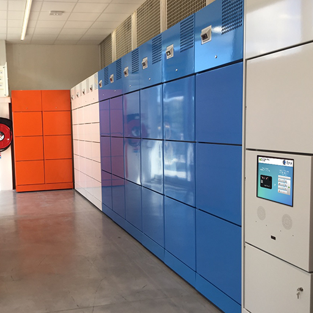

# EptaBrick Branding Customization \(Marketing Pictures\)

## heading2
### heading1


Image supported format are : PNG 8,24 and 32 bits per pixel. PNG 32 bpp transparency alpha is supported.



Retailer can provide one set of custom picture for all the EptaBricks installed under it brand. EptaBrick also support customization for one given installation depending on the region or city of installation. Contact EptaBricks Software team for custom site installation at software@epta-iot.com.



Contact [software@epta-iot.com](mailto:software@epta-iot.com?subject=Branding%20Customization%20Help) for more information if required.


