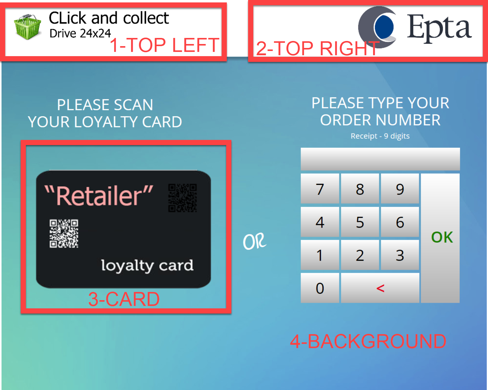

# Layout

Every views displayed on the EptaBrick is a based on a basic layout composed in two part:

* Top-Banner which contain the Retailer logo and a marketing brand for the EptaBrick \(Click & Collect, DriveBox, Drive 24/24,etc...\)
* The Body which contains a background picture overlaid by user controls \(UI/UX\)


Optionally a loyalty card or an order bill, QR Code, etc... can be added on the connection screen to tell the customer to scan it an collect his order faster. \(Every EptaBrick is build up with a scanner under the touch screen\)


