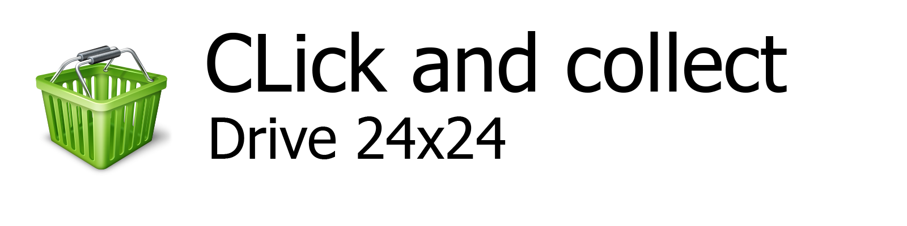

# Top-Left Marketing


_**Top-Left Marketing picture Specification**_

The  picture  has to be 640x160 minimum size. 

It can be bigger as long has it is 4:1 ratio.

The content should be align on left for better looking if it doesn't fill the total width.

Transparency allowed. \(PNG 32bpp\)


